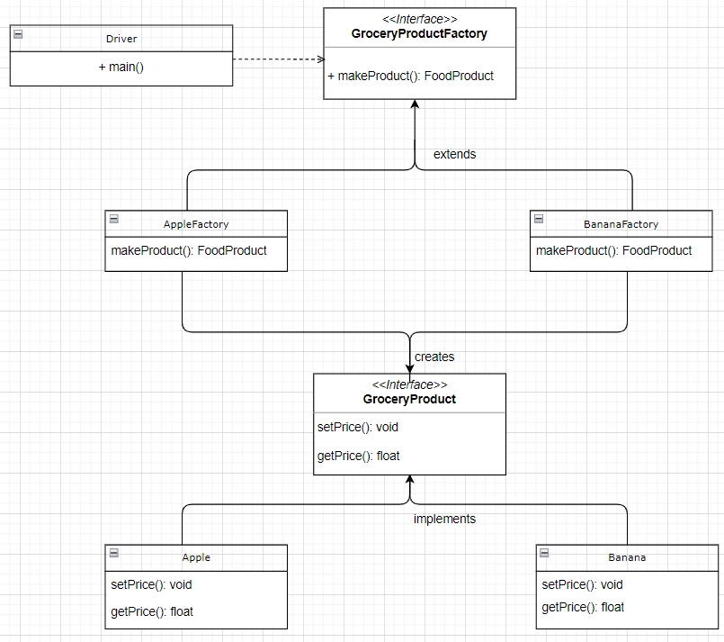
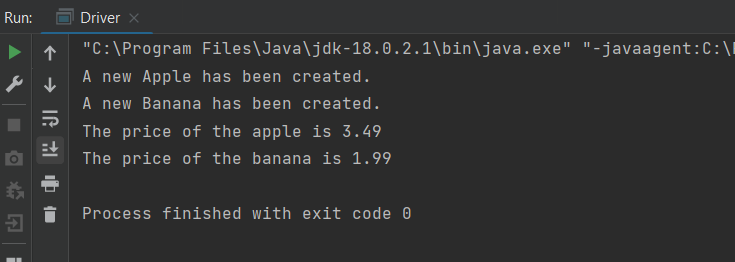

# Design_and_Architecture_Assignment_1

We have an abstract factory which extends which has two factories Apple and Banana. They have an interface called Grocery Product which extends two components, Apple and Banana. The AppleFactory and BananaFactory have reading implementations from the text file and get the price to update the setPrice Function and change for the Apple and Banana component.

DIRECTORY STRUCTURE

Directory src/fruitfactory/: Contains Source Java Files (Fruitfactory package)  

FruitFactory Package: Contains all interfaces and relevant factory classes

Directory test: contains the driver class (test package)

FILE RESPONSIBILITIES

Apples.java : Creates an apple class implementing the GroceryProduct overriding the setPrice and getPrice functions

AppleFactory.java : Creates an AppleFactory implementing the GroceryProductFactory, has a constructor to fetch the price and overrides the makeProduct function to create a new apple product.

Bananas.java : Creates a Banana class implementing the GroceryProduct overriding the setPrice and getPrice functions

BananaFactory.java : Create a BananaFactory implementing the GroceryProductFactory, has a constructor to fetch the price and overrides the makeProduct function to create a new banana product.

GroceryProduct.java : An interface with getter and setters for price

GroceryProductFactory.java : A factory interface with a makeProduct definition 

database.txt : Contains a list of Fruit and their prices

UML_MODEL.drawio: UML File

OUTPUT: 

Tanish Singla (100782583)              
Harsh Tamakuwala (100824220)  
Akshat Gupta (100813132)
